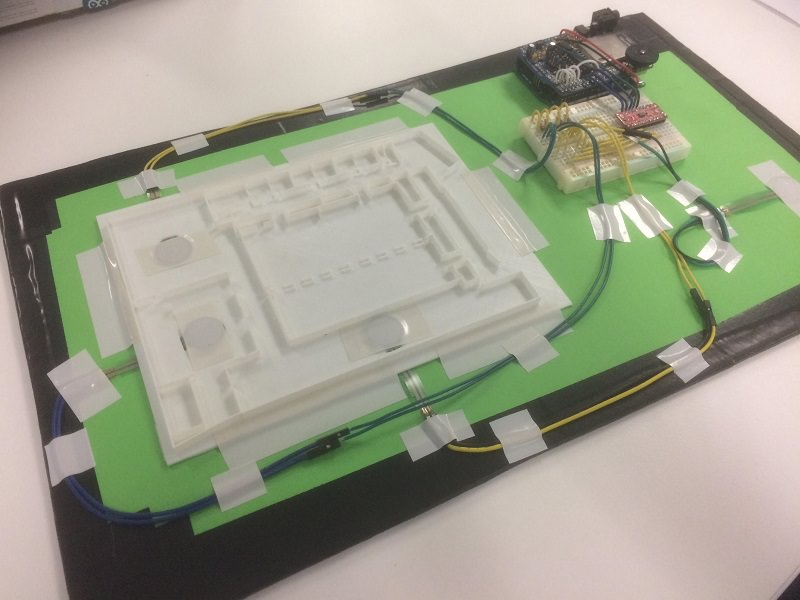

# FIT1041

Designing tangible interfaces for the low vision community.

All code used in prototyping can be found in the [touch_map](./touch_map) directory.

## Requirements

The [WaveHC](https://github.com/adafruit/WaveHC) library, courtesy of Adafruit. Needed to interface with the Arduino Wave Shield

An Arduino with at least an ATmega328 chip

Minor soldering skills

## Built using

 - An Arduino Uno
 - A multiplexer, in this case Sparkfun's 8channel breakout board ([ID #74HC4051](https://www.sparkfun.com/products/13906))
 - Force Sensitive Resistors (FSR), in this case Adafruit's 3/4in FSRs ([ID #166](https://www.adafruit.com/product/166))
 - An Arduino-friendly audio shield, in this case Adafruit's Wave Shield ([ID #94](https://www.adafruit.com/product/94))
 - A lot of wiring and 10Kohm resistors

## Report

Can be found [here](./report.md).

## Weekly Worklog

[Week 2](./worklog/WEEK2.MD)

[Week 3](./worklog/WEEK3.MD)

[Week 4](./worklog/WEEK4.MD)

[Week 5](./worklog/WEEK5.MD)

[Week 6](./worklog/WEEK6.MD)

[Week 7](./worklog/WEEK7.MD)

[Week 8](./worklog/WEEK8.MD)

[Week 9](./worklog/WEEK9.MD)

[Week 10](./worklog/WEEK10.MD)

[Week 11](./worklog/WEEK11.MD)

[Week 12](./worklog/WEEK12.MD)

## Acknowledgements

Portions of code have been copied and adapted from Adafruit's tutorials on the Wave Shield, found [here](https://learn.adafruit.com/adafruit-wave-shield-audio-shield-for-arduino). All credit for this belongs to Adafruit.