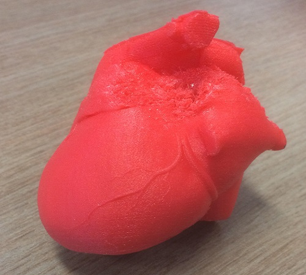
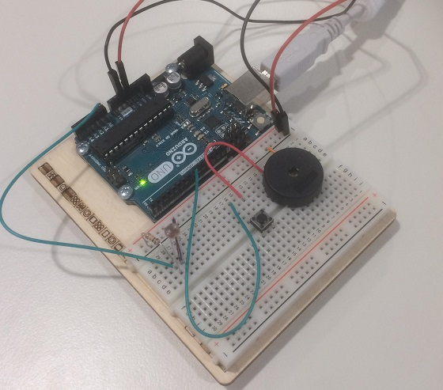
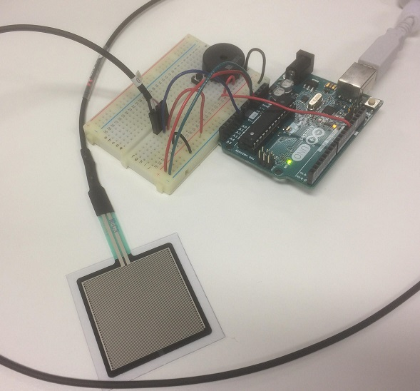
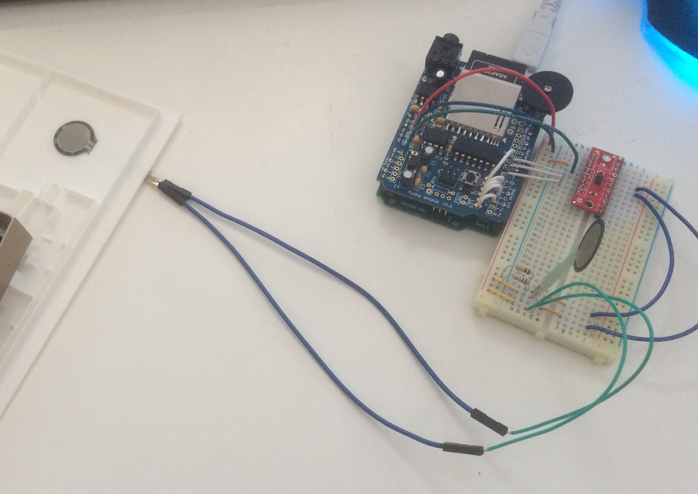

# Tangible Interfaces For The Vision Impaired

### Nicholas Whittaker
### FIT1041: Research Project
### Tangible Interfaces for the Vision Impaired
### Undertaken in partnership with Monash SensiLab and Monash University

## Contents
 - [Context](https://github.com/NickelOz/fit1041/blob/master/report.md#context)
 - [Aims / Goals](https://github.com/NickelOz/fit1041/blob/master/report.md#aims--goals)
 - [Timeline / Approach](https://github.com/NickelOz/fit1041/blob/master/report.md#timeline--approach)
 - [Design Choices](https://github.com/NickelOz/fit1041/blob/master/report.md#design-choices)
 - [Prototype Creation](https://github.com/NickelOz/fit1041/blob/master/report.md#prototype-creation)
 - [Evaluation](https://github.com/NickelOz/fit1041/blob/master/report.md#evaluation)
 - [Conclusion](https://github.com/NickelOz/fit1041/blob/master/report.md#conclusion)
 - [Reflection / Difficulties](https://github.com/NickelOz/fit1041/blob/master/report.md#reflection--difficulties)
 - [Credits / Acknowledgement / Thanks](https://github.com/NickelOz/fit1041/blob/master/report.md#credits--acknowledgements--thanks)

## Context

In the 21st Century, newer technologies and the internet have spurred to the spread of information, as well as continuing goal of making it more accessible to a global audience. For members of the low-vision community, the wide availability of smart-phones has provided greater access to digital information and easy to use methods of communication. However, an area still needing greater development is related more to graphical and physical information.

Objects like the map of a public space, the layout of a building or the shape and appearance of a landmark are often best described by a tangible representation, a model that someone with a vision impairment or blindness can grasp, touch and interpret with their hands. Technologies such as 3D printers, which can generate models in a matter of hours by layering together cross sections of a digital object using plastic resin, and swell paper, which uses a combination of special ink and paper that expands under heat to create pages with raised sections for a user to guide their hand across.

While these approaches to succeed in communicating these graphical details, they lack the ability to communicate all relevant information about a model. While it is beneficial to the low vision community to be able to create these objects to help them understand a map or 3D object, it is detrimental to sacrifice this greater context in producing a representation.

Thus, working to develop a solution that overcomes this weakness and provides this often necessary context will help in the continuing development of accessible objects for those with vision impairments.

##### A map of a train station, printed on swell paper

##### A print of the Sydney Opera House, those with vision impairments often struggle to interpret the 'sails' that make up the roof
###### Original image taken by Andrew Kallasmae

## Aims / Goals

For this project, a prototype was designed using an [Arduino](https://www.arduino.cc/en/Guide/Introduction), which can be used to create small electronic units that can operate without external dependencies.

Thus, the most suitable approach to is to follow the methodology taken in 'Design Science'. Its focus on investigating, developing and evaluating a product aligns with the goal of this project, to work towards a solution that makes 3D objects more accessible to those with vision impairments.

While this project is limited by time, keeping a detailed log of how the prototype was developed will help to facilitate further development in this area, and the possibility for the prototype to be iterated upon in future and improved. 

Aside from simply producing a prototype, there should also be justification for the choices made during the design stage. With any components used for building the prototype, it should be made clear why those particular parts were chosen, and what advantages they offer over other possible choices.

In regard to the prototype itself, it should provide additional context through having the user perform a simple interaction with it, and they should then gain additional context about the object through feedback, whether haptic or auditory.

To evaluate, the following areas of the prototype should be examined, and discussion should be provided on how this could be taken into consideration for future development.

 - How sturdy is the product? Could it be considered portable?
 - Does it succeed in communicating further context?
   - Extending this, does it provide this accessibility without disrupting the surface of the object?
 - Were there any other observations made over the course of the project that should be considered in future?

In summary, this project should attempt to answer the questions *'How can 3D constructions of graphical models and maps be made more accessible for users with vision impairments? Can this be done without sacrificing the shape of the model itself?'*.

## Timeline / Approach

In line with the outlined methodology, this project can be summarised into three main stages.

#### Investigate / Experiment
Experiment with the Arduino and investigate the different ways than an Arduino can detect and respond to input. Other possible sources for components include Australian retailers, and distributors such as [Adafruit](https://www.adafruit.com/category/17) and [Sparkfun](https://www.sparkfun.com/categories/103). Pre-prepared sets like the [Arduino Starter Kit](https://store.arduino.cc/usa/arduino-starter-kit) also contain a myriad of useful components and an opportunity to get 'hands-on' investigation done before settling on a rough design for the end product. This should conclude by developing a list of components to build the end product with.

#### Build / Design
After settling on which components to use in the design phase, it necessary to solder any ordered components, wire them in with the Arduino and develop code to run on the board and provide the product's functionality. This is outlined in more details in the 'Prototype Construction' section.

#### Demonstrate / Evaluate
After building the prototype, critique and observations from live demonstrations and development should be used to evaluate how well the prototype meets it set goals. As stated earlier, this will help determine what the products succeeds at, as well as highlight shortcomings, which are useful for iteration in future.

## Design Choices

In current practice, there are numerous ways to makes objects more accessible via touch. Included below are the majority of the investigated options, some with accompanying photos of the components in use with an Arduino.

These options can include purely physical approaches, such as

#### Braille Stickers

These are fairly easy to print and affix to objects, braille stickers can be printed using special label makers. However, while they can be produced in a quick, affordable manner, they compromise the surface of an object by adding small bumps. Given their need to be small enough to be affixed to an object, their accompanying text must also be short, no longer than two short words. This is quite a severe limitation, and does not provide the possibility of communicating more than a basic title or very short description.

<!-- TODO: IMAGE OF BRAILLE STICKERS -->

#### Textiles/Patterns

Using a high-quality printer, different patterns can be printed onto a map. For example, thin criss-crosses, thick diagonal lines or polka dot patterns can signify different buildings on a flat map, or rooms in a house. This is useful because it does not interrupt the overall shape of an object, and makes it easy to divide a terrain or a 3D space into separate areas. However, it also requires that each of these sections have a distinct pattern, so they can be discerned by touch, as well needing to be printed with a high-quality printer so that these patterns can be reproduced accurately while still keeping the surface 'flat', which tends to be expensive and beyond the access of the general community.

<!-- TODO: IMAGE OF VISION AUSTRALIA CENTRE, LASER CUT -->

#### Printing Materials

With a wider array of plastics for 3D printing, more interactive objects can be made. The prime example of this is a model of a human heart. While with a harder plastic, a person with low vision might only be able to discern the basic shape of the muscle and the outlines of a major blood vessel, using a softer plastic would allow them to 'feel' how it would beat, and squeeze it like a muscle.

##### A 3D printed model of a human heart, made using a flexible plastic that be bent and squeezed

Seeing as the primary focus of this prototype was to produce something that outputs audio, there were several methods to consider investigating, such as

#### Capacitive Touch Points

By using large conductive points, actions can be triggered through human contact interrupting a circuit. In models, the can be put into use by placing copper plates on the top of key points and threading wiring through buildings or objects. However, the functionality is hampered by the fact even a light touch can activate it. Momentary contact with any point will interrupt the circuit and trigger a response.

This can be circumvented by requiring a user to 'double-tap' in quick succession or hold their finger on a point for several seconds, but while this avoids the shortcomings of capacitive touch, it introduces further unnecessary complexity to user interactions and places greater dependency on them. These models may be more accessible, but at the cost of user's experiences.

While these touch points can be incorporated smoothly into objects, the way in which they can be triggered by idle brushes of a user's hand prevents them from being of benefit to those with low vision, who rely on touch and hearing alone to gain an understanding of an object. Although this limitation can be overcome, it only steepens the difficulty slope for those low vision users by adding another level of complexity for them to deal with.

#### Buttons

Buttons were another consideration, particularly because they have two clear binary states (pressed/unpressed). This makes it easy to set off actions, such as audio, when a button is pressed. It is also useful as it avoids the general uncertainty of when a button is pressed, as long as it has sufficient resistance to require a force press to activate.

However, their large size would mean they jut out of whatever object they were applied to. Without significant consideration during the design stage to create modified models for them to be built into, creating a prototype that these buttons can incorporate into smoothly is too much of a time cost. Even then, the buttons would need to be connected to a breadboard or similar board to run wires off of, making the creation of suitable models too time-consuming an operation, as each model would need to be addressed on a case-by-case basis.

#### RFID Tags

With a special Arduino component, RFID tags can be read by an Arduino. While useful, its disadvantages outweigh its benefits. To operate, a unit to scan the tags would need to be carried around. It would have to contain the Arduino to handle logic, the RFID reader itself, a shield to handle audio output and a component to play emit audio, though headphones could suffice. Even then, the unit itself would be bulky and inconvenient to carry around, acting as a detriment. Since different tags, each with different sound files, would need to be used, the Arduino would need to be reprogrammed with each successive tag and audio file addition, as it cannot rely on an external entity, such as a server, to handle this data.

##### An RFID Reader, with its accompanying cards, connected to an Arduino

#### Photoresistors

A temporary consideration. They can be used to accurately detects changes in light levels, like a light tripwire. They are far too easy to activate unintentionally though and also require a breadboard to run through the Arduino.

##### An Arduino that can be played like a theremin by raising and lowering a hand over the photoresistor

#### Force Sensitive Resistors (FSRs)

As greater pressure is applied, the resistance through these components increases, which can be used to trigger sounds in a similar manner to capacitive touch points. Given their size and cost, they cannot greatly discern differences in the force applied to them, but can differentiate between, a heavy, medium or light press, which is sufficient for acting as a trigger. Their small, thin size means they can be placed on a flat surface with a small amount of adhesive.

##### An FSR set up with an Arduino to produce a tone that raises in pitch as more pressure is applied

## Prototype Creation

The creation of the prototype followed 4 main stages

#### Formalising Components for Build

Once a variety of possible methods were investigated, it was necessary to list all necessary items for the build to be ordered.

A copy of the prototype specifications passed onto SensiLab for ordering can be found [here](https://drive.google.com/file/d/0B-P4-RA44wmtZ0tCeFZkeHNoNFE/view). Alternatively, it can be viewed in markdown [here]().
<!-- TODO: MARKDOWN OF PROTOTYPE SPECIFICATION -->

The key components used in building the prototype were as follows
 - The 'Wave' Shield, which can be placed over an Arduino, and used to play a variety of audio files with the provided library for interfacing with the shield.
 - A small 8-way multiplexer, which would allow multiple touch points to be connected and polled sequentially. Without this, the prototype would be severely limited, as the Wave shield leaves very few pins (points to connect wiring to) available for other components to use. Without this, there would not be the capability to extend the number of touch points to place FSRs beyond 4.
 - 4 FSRs, to sense user interaction
 - A SD Card, although not ordered, was used to store audio

#### Soldering Components

This was a slow and careful process. While building the multiplexer required only header pins (long pins designed to plug into an Arduino/breadboard) be connected, soldering the Wave shield required the steps outlined in [Adafruit's guide](https://learn.adafruit.com/adafruit-wave-shield-audio-shield-for-arduino/solder) be followed precisely.

It should be noted that careful soldering is needed with particular components, such as the operational amplifier, as mistakes during this stage are hard to correct and can compromise the shield's ability to operate effectively, and possibly prevent it from functioning altogether.

#### Program Logic

A full copy of the code used for the Arduino can be found [here](./touch_map/touch_map.ino).

To read and respond to stimuli, each of the FSRs was polled through the multiplexer, with a pressure threshold being used to trigger sound bites.

##### A pair of coin-sized FSRs connected to their Arduino, polled using a multiplexer

While this code was largely adapted from the available tutorials online, the key aim was to raise the majority of the configuration variables (polling interval, audio filenames, Arduino pins used for I/O) up to a global state, so that adjustments could easily be made to cater to an evolving design. This would allow more touch points to configured in future and to tune to the sensitivity of the map for different environments.

#### Construction

To build a functioning prototype, a map would need to be mounted on a sturdy board for portability and organisation. For this, a large rectangle of cardboard was used, so that the map and wires could be taped down and lie flat on the surface.

To build the map, small slits were cut through a donated 3D print of a large building, similar to one that might be used as a guide in a public space. Using a small handheld saw, 1cm incisions were made into the map, through which FSRs could be inserted through to run underneath the model.

##### An FSR connected the Arduino, and inserted into the map by cutting a small slit to pass wiring through

For clarity and visual appeal, the wiring of the Arduino was recut and taped down to run flat across the map.

After connecting up a sound output device, in this case a small battery powered speaker, and loading the audio files onto the microSD card, the prototype was ready to present.

##### The finished map, with each FSR being through the multiplexer to trigger audio from the Wave shield

## Evaluation

Following the criteria outlined earlier, the prototype can be evaluated in the following areas. These observations were made over the course of production and during the product's demonstration.

### Sturdiness / Portability

The end product was fairly vulnerable to being knocked around and having pins come loose. This was a primary issue with the FSRs, whose short legs were designed to connect into a breadboard or into an Arduino directly. This weakness was overcome in development by connecting them into female-to-female extension cables, but even slight jostling of these would result in the FSRs legs coming loose and preventing the touch points from working. A similar issue occurred with some of the wiring, which are not designed to be soldered to the board. During demonstrations, the Arduino and Wave shield were accidentally knocked from their place on the board, and this prevented the board from working for the rest of the presentation, as attempting to interface with the SD card would fail, and hence the board would not start up.

In future this could be avoided by carefully soldering the FSRs to the extension cables, which was not done this time around because of the very steady handiwork needed, and using carefully folding any unsoldered wired in the Wave shield so it is harder for them to come loose if the unit is shaken. Building a small container to hold the breadboard and Arduino/Wave shield may also help protect the unit, and stop loose wiring being interfered with.

### Accessibility

Overall, the FSRs did succeed at being the sensor that could be incorporated in the easiest and most fluent manner into an object. In the prototype, they would only leave a protrusion the size of a small coin when held down by tape. Their thin lead strip was also useful, as it was much easier to pass this through the incision in the map to connect to external wiring as opposed to passing the bulkier wiring through itself.

When the other users were interacting with the map during the demonstration, most seemed quickly able to grasp that they could pass their hands over the touch points without triggering them, and were then able to correctly apply pressure to hear the tracks for each touch point. While this does speak for how the prototype would perform with vision impaired users, it does indicate that the FSRs bode well for use.

### General

For this project, the Wave shield was chosen for how easy it was to quickly change wiring or audio files without having to disconnect the unit itself. Ultimately, a large amount of memory on the SD card was unused, and the shield itself reserved a lot of the Arduino's pins, leaving only 4 available for digital IO out of the standard 12. Alternatives to the Wave Shield are available, including a [breakout board](https://www.adafruit.com/product/2220) from Adafruit, and it would be good to investigate whether these are viable options, given their price and size. The Wave shield remains a good choice for future prototypes though, as its drawbacks do not limit the functionality of the final product.

The audio files themselves, however, were fairly inconsistent volume-wise. For example, short sound effects or songs would be very loud when played, while a voice recording would be fairly inaudible in comparison. While technically this problem could be overcome by having all files be recorded in a single session at the same level, a better solution would be create a small program that parses all audio files, and ensures they are at an equal sound level. This would also help to ensure that all files are in 16bit WAV with a frequency response of 22050Hz as well, which the shield requires. While the Wave shield does have a sound knob, having to adjust it for every different object, or indeed every different sound file, is not user friendly and should be avoided.

One more possible avenue to investigate could involve combining the FSRs with a more flexible printing plastic, to create 'subdermal' touch points, which could hypothetically provide the functionality of audio triggers without disturbing the surface of an object at all.

## Conclusion

This project has shown that there are certainly methods available for making 3D models more accessible to those with vision impairments. Numerous options are available to read and respond to the physical actions of users through touching and pressing on the surface of an object to trigger audio files that provide further contextual information. 

The route taken with the project to use Force Sensitive Resistors demonstrated that the capability to detect and respond to input to provide context is becoming easier and more affordable to accomplish, and that sacrificing the shape or quality of an object is not necessary to provide this accessibility.

While this project does not provide a complete solution, it does explore and compare the currently available options, and evaluates the plausibility of one possible implementation, which can also prove useful for future development.

With the growing availability of more affordable technologies for the Arduino, it is clear that the capability to make graphical information accessible to those with low vision and blindness is continually becoming a more achievable goal.

## Reflection / Difficulties

Unforeseen problems with building the Wave shield, resulting in the need to resolder, caused quite a significant time impact to the project timeline. Overall, it would have been beneficial to have ordered components roughly a week earlier, to allow for these setbacks and to prevent them from cutting into the prototype build time.

## Credits / Acknowledgements / Thanks

Thanks to Elliot Wilson of SensiLab, for his help in soldering and correcting my mistakes when building the Wave Shield.

Finally, many thanks to Matt Butler, whose help as a mentor and project supervisor proved invaluable in design and building the prototype, as well as helping to direct me over the course of this project.